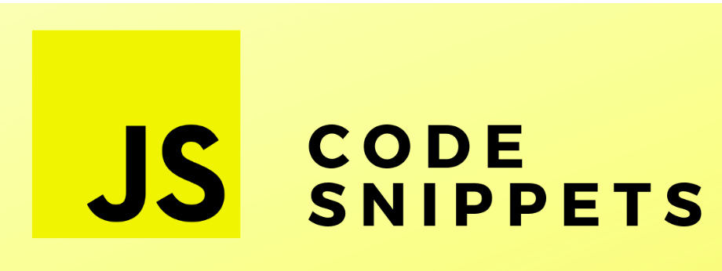

Browser DevTools code snippets
> Apps, Automation, Performance, debugging and testing code snippets to be run in DevTools
## :notebook: Browser DevTools code snippets

## Snippets
🌟 - New Snippet

| Name                                                                              | Short Description                                          | Category       |
| --------------------------------------------------------------------------------- | ---------------------------------------------------------- | ---------- |
| [EasterEgg](./snippets/Funny/easterEgg.md)                                   | find an EasterEgg in Google.com | funny
| [MemeGenerator](./snippets/Funny/memeGenerator.md)                                   | create meme over webpage | funny

### How to Run
Run in Chrome Browser [[here]](https://www.google.com/search?q=how+to+run+snippet+in+chrome&oq=how+to+run+snipper&aqs=chrome.1.69i57j0l7.4817j0j7&sourceid=chrome&ie=UTF-8)]

## What is Next?

We are planning to add more and more projects to this repository. For this, we need your help! Find out how to contribute below. 👇

We are also planning to create a website where you can easily browse through all of the projects.

## Contribution

Any contributions are very much appreciated. :pray: You can contribute in 2x ways:

1. Create an issue with your snippet :hammer_and_wrench:. Make sure that you use the **new js-snippet** label in this case;
2. Fork the project. Before doing that, please make sure that you read and follow the [Contribution Guide](./CONTRIBUTING.md);

### Main Contributors :bulb:🙂

- **crisanlucid**: [Twitter](https://twitter.com/lucianTopcraft) - [Article](https://www.codementor.io/@crisanlucid/how-i-debugged-my-code-in-javascript-using-snippets-from-chrome-devtools-yum6fatrl) - [website](https://sites.google.com/view/news-landingpage/index)
- **elona**: [Linkedin](https://www.linkedin.com/in/elona-gusho-a60a6959/)
- **you can be NEXT**

## Stars history

## License

[MIT](http://www.opensource.org/licenses/MIT)

